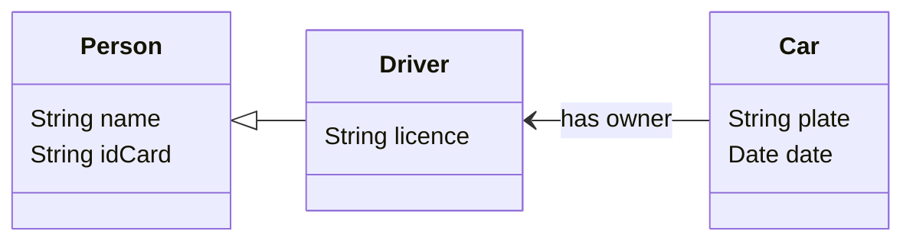

# MyApi (v3)
A REST API to interact with information regarding persons, drivers and their cars.
Similar to [MyApi (v1)](https://github.com/catarinafoliveira/myApi_v1), but using authentication and authorisation.



## Prerequisites
[NodeJS](https://nodejs.org/en/download/prebuilt-installer/current)

[DB Browser for SQLite]( https://sqlitebrowser.org/dl/)

## Installation
Use the command line inside the project's folder:

```bash
npm install
```

## Usage
Run the project in VSCode, with or without debugging, or run in the command line inside the project's folder:

```bash
node app.js
```

## Test
<!-- First, create a SQLite database on the project's root folder and add a `users` table with the following columns:
 -->

To test the API use, for example,
[Postman](https://www.postman.com/downloads/) and start by using the route to create an user:
| Type     | Route              | 
| ----     | -----              | 
| `POST`   | /api/auth/register | 

To create an employee, fill the body of the request with a JSON object in the format:

```
{
    "username":"username",
    "password":"password",
    "idCard":"XXXXXXXXX",
    "role":"employee"
}
```

To create a driver, fill the body of the request with a JSON object in the format:

```
{
    "username":"username",
    "password":"password",
    "idCard":"XXXXXXXXX",
    "licence":"AAXXXXXXXX"
    "role":"driver"
}
```

Employees are allowed to access all routes. Drivers are only allowed some of them:

### Persons routes:
| Type     | Route        | Description         | Authorisation |
| ----     | -----        | -----------         | --- |
| `POST`   | /api/persons | Create a new person | &cross;|
| `GET`    | /api/persons | Show all persons    | &cross; |
| `GET`    | /api/persons/id/:id | Get a person by ID | If :id is the user's ID |
| `GET`    | /api/persons/name/:name | Get a person by name | If :name is the user's name |
| `GET`    | /api/persons/idcard/:idcard | Get a person by ID card | If :idcard is the user's ID card
| `PUT`    | /api/persons/:id | Edit a person | If :id is the user's ID |
| `DELETE` | /api/persons/:id | Delete a person | If :id is the user's ID |

### Driver routes:
| Type     | Route        | Description         | Authorisation |
| ----     | -----        | -----------         | --- |
| `POST`   | /api/drivers | Create a new driver | &cross;|
| `GET`    | /api/drivers | Show all drivers    |&cross;|
| `GET`    | /api/drivers/id/:id | Get a driver by ID |If :id is the user's ID |
| `GET`    | /api/drivers/name/:name | Get a driver by name |If :name is the user's name |
| `GET`    | /api/drivers/idcard/:idcard | Get a driver by ID card | If :idcard is the user's ID card |
| `GET`    | /api/drivers/dl/:dl | Get a driver by driver's licence | If :dl is the user's driver's licence |
| `PUT`    | /api/drivers/:id | Edit a driver | If :id is the user's ID |
| `DELETE` | /api/drivers/:id | Delete a driver | If :id is the user's ID |

### Cars routes:
| Type     | Route        | Description         | Authorisation |
| ----     | -----        | -----------         | --- |
| `POST`   | /api/cars | Create a new car | If the value in ownerDL on the request body is the user's driver licence |
| `GET`    | /api/cars | Show all cars    | &cross;|
| `GET`    | /api/cars/id/:id | Get a car by ID | &cross;|
| `GET`    | /api/cars/plate/:plate | Get a car by plate | &cross;|
| `GET`    | /api/cars/owner/:dl | Get a car by owner driver's licence | If :dl is the user's driver's licence |
| `PUT`    | /api/cars/:id | Edit a car |&cross;|
| `DELETE` | /api/cars/:id | Delete a car |&cross;|
